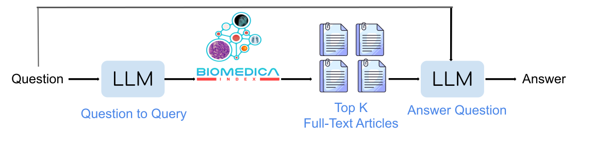

<div align="center" style="margin-bottom: -20px;">
    
</div>


<p align="center">
  <strong>Arxiv:</strong> <a href="https://arxiv.org/pdf/2501.07171" target="_blank">Arxiv</a> 
  &nbsp;&nbsp;&nbsp;&nbsp;|&nbsp;&nbsp;&nbsp;&nbsp;
  <strong>Website:</strong> <a href="https://minwoosun.github.io/index-website/" target="_blank">Biomedica Index</a>
  &nbsp;&nbsp;&nbsp;&nbsp;|&nbsp;&nbsp;&nbsp;&nbsp;
   <strong>Models and Datasets </strong> <a href="https://huggingface.co/BIOMEDICA" target="_blank">Hugging Face</a>
</p>


**Welcome to the official Biomedica Index Repository!**

This is a new consumable version of the BIOMEDICA Archive, allowing multimodal retrieval of similar images, captions, and full-text articles.

## Quickstart
### Online Demo
For quick trial/demo purposes, use this **Colab notebook:**

https://colab.research.google.com/drive/15qyeCCY7nlgSnNstJw9kVLHwlvIUZieB?usp=sharing

See also the Mounting Data section below.

### Local Setup
Code:
```
pip install "biomedica-index[all] @ git+https://github.com/biomedica-marvl/biomedica-index.git"
```

Download (or mount) the **Google Drive folder of necessary index data**:

https://drive.google.com/drive/folders/1MM3-birHJobagiznDZYfHtbFpkuawuPN?usp=drive_link


## Installation
To install the full capabilities of the index, run the following command in the environment of your choice:
```
pip install "biomedica-index[all] @ git+https://github.com/biomedica-marvl/biomedica-index.git"
```

For more specific use cases, we provide the following options:
- `biomedica-index` (no \[brackets\]): Installs minimal dependencies for keyword/BM25-based retrieval, or for vector-based search if `torch`, `torchvision`, and/or `transformers` were installed separately.
- `bimomedica-index[text]`: For the full range of text-based search capabilities.
- `biomedica-index[image]`: For image-based search capabilities (but not vector-based text capabilities).
- `biomedica-index[all]`: Installs the full index.

## How to query the Biomedica Index
To make the Biomedica dataset queryable, we currently provide two major tools: 
- `BiomedicaIndex`: used to retrieve identifying metadata on relevant articles and figures, given text or image prompts
- `BiomedicaArticleLoader`: loads full-text article data (the title, abstract, and publish date), given identifying metadata

For full use, we currently require the data needed for the index to be downloaded locally on the user's machine. Available data for the current index functionality is downloadable [from Google Drive](https://drive.google.com/drive/folders/1MM3-birHJobagiznDZYfHtbFpkuawuPN?usp=drive_link). A more practical solution is currently in development, but we release this version to allow interested parties access to the index as quickly as possible.

For a simple initial trial, we have provided a simple [Colab notebook](https://colab.research.google.com/drive/15qyeCCY7nlgSnNstJw9kVLHwlvIUZieB?usp=sharing) for initial testing. To use it, please also see the Mounting Data section below. 

Minimal snippet for articles:
```python
import biomedica_index as bi
index = bi.BiomedicaIndex(INDEX_PATH)
loader = bi.BiomedicaArticleLoader(INDEX_PATH)
text_query = 'article search query'
top_articles = index.query_articles(text=text_query, top_k=5, subsets='all')
for metadata, score in top_articles:
    print(metadata['pmcid'], metadata['subset'])
    title, article_body, unix_date = loader.get_article(metadata)
    # do stuff with the article data
```

For figures:
```python
import biomedica_index as bi
from PIL import Image
index = bi.BiomedicaIndex(INDEX_PATH)
query_image = Image.open('my_query_image.jpg')
query_text = 'caption search query'
top_figures = index.query_figures(image=query_image, text=query_text, text_mode='all', \
                                  top_k=5, subsets=['noncommercial'])
```

For full details on how to use this package, please see the API reference section below.

### Mounting Data
Instead of downloading the full data, the folder can also be mounted using [Google Drive for desktop](https://support.google.com/drive/answer/10838124) or using Google Colab. To achieve this, please open the [Google Drive link to the folder](https://drive.google.com/drive/folders/1MM3-birHJobagiznDZYfHtbFpkuawuPN?usp=drive_link) and follow these instructions to add the shared folder as a shortcut within your main Drive:
- Click on the bmca_index name at the top (the folder name)
- Select Organize > Add shortcut
    - This will add a "symlink" to the shared folder within your Google Drive account, making the folder accessible if you mount your main drive anywhere.

### API reference
```
class BiomedicaIndex(builtins.object)
 |  BiomedicaIndex(index_path, embedder_device=None, search_multiplier=1, RRF_k=60)
 |  
 |  Class to retrieve the most relevant items in the Biomedica dataset given a query.
 |  Can retrieve most-relevant articles by text and most-relevant figures by image or text.
 |  Functions intended for internal use have a leading _underscore.
 |  
 |  Methods defined here:
 |  
 |  __init__(self, index_path, embedder_device=None, search_multiplier=1, RRF_k=60)
 |      Initializes the index.
 |      
 |      Parameters:
 |          index_path (str): path to the data needed for the index
 |          embedder_device (str OR torch.device): device used for query embedding models
 |          search_multiplier (int): expands the number of items used for hybrid search. specifically,
 |              the top (k*search_multiplier) results from each search type are considered during RRF
 |          RRF_k (float): k-value used in the RRF denominator (default is 60, which is commonly used)
 |  
 |  query_articles(self, text, top_k=5, subsets='all')
 |      Retrieves the most relevant figures given an image or caption query.
 |      
 |      Parameters:
 |          text (str): text to use as query for relevant articles via keyword-based (BM25) search
 |          top_k (int): number of highest-ranking items to return
 |          subsets (str OR list[str]): either the string 'all' (to use all subsets)
 |              or a list containing some subset of {'commercial','noncommercial','other'}
 |      
 |      Returns:
 |          a list of (BM25 score, metadata_dict) tuples, where each metadata_dict contains:
 |              pmcid (str): the PMCID of the article
 |              subset (str): the Biomedica subset the article comes from
 |      
 |      Raises:
 |          AssertionError: if any of the subsets is not a valid option
 |  
 |  query_figures(self, image=None, text=None, text_mode='all', top_k=5, subsets='all')
 |      Retrieves the most relevant figures given an image or caption query.
 |      
 |      Parameters:
 |          image (PIL.Image): image to use as query for images (embedding similarity search)
 |          text (str): text to use as query for figure captions
 |          text_mode (str): specifies how the text query should be used. one of:
 |              'keyword' = use keyword-based (BM25) search only
 |              'vector' = use vector-based (embedding similarity) search only
 |              'all' = use both bm25 and vector-based search
 |          top_k (int): number of highest-ranking items to return
 |          subsets (str OR list[str]): either the string 'all' (to use all subsets)
 |              or a list containing some subset of {'commercial','noncommercial','other'}
 |      
 |      Returns:
 |          a list of (RRF score, metadata_dict) tuples, where each metadata_dict contains:
 |              pmcid (str): the PMCID of the article the figure comes from
 |              subset (str): the Biomedica subset the figure comes from
 |              shard (str): the ID for the Biomedica Webdataset shard the figure comes from
 |              filekey (str): unique identifier for the figure
 |              caption_text (str): the text of the original figure caption
 |      
 |      Raises:
 |          AssertionError: if text_mode or any of the subsets is not a valid option
 |  
 |  ----------------------------------------------------------------------
 |  Data and other attributes defined here:
 |  
 |  KEYWORD_QUERY_TYPES = ['full_text-kw', 'caption-kw']
 |  
 |  QUERY_TYPES = ['image', 'caption', 'full_text-kw', 'caption-kw']
 |  
 |  VEC_QUERY_TYPES = ['image', 'caption']
```

```
class BiomedicaArticleLoader(builtins.object)
 |  BiomedicaArticleLoader(index_path, local_article_path=None)
 |  
 |  Class to load full-text article data given identifying metadata (subset and PMCID).
 |  Functions intended for internal use have a leading _underscore.
 |  
 |  Methods defined here:
 |  
 |  __init__(self, index_path=None, pmcid_article_map=None, local_article_path=None)
 |      Initializes the index.
 |
 |      Parameters:
 |          index_path (str): path to the data needed for the index. used to find the mapping of
 |              PMCIDs to actual article text
 |          pmcid_article_map (str): (optional) path to an overriding JSON file that maps PMCIDs
 |              to the locations of article batch files, as they are stored on the user's system
 |          local_article_path (str): (optional) path to the local directory where the article
 |              full-text is stored. If not provided, the loader attempts to find it in the default
 |              place within the index data itself.
 |  
 |  get_article(self, article_metadata)
 |      Loads article full-text data based on the given metadata.
 |      
 |      Parameters:
 |          article_metadata (dict): dictionary containing metadata for the article. Must contain:
 |              'subset': the Biomedica subset where the article is located
 |              'pmcid': the PMCID of the article
 |      
 |      Returns:
 |          tuple of data for the full-text article, specifically: (
 |              title (str): the title of the article,
 |              nxml (str): the XML body of the article, saved as a string
 |              date (str): the date the article was published, represented as a Unix timestamp
 |          )
 |      
 |      Raises:
 |          KeyError: if the input does not include all necessary identifying metadata
 |          (for now) NotImplementedError: if the user attempts to load articles non-locally
```

## Data
The Google Drive folder contains the following sub-directories:
- `ARTICLES` contains batches of full-text articles and is used by the `BiomedicaArticleLoader` to retrieve a full-text article given its PMCID.
- `full_text-kw` contains the BM25 pre-computed index needed to compute the **most relevant articles** given a user query.
- `caption-kw` contains the BM25 pre-computed index needed to compute the **most relevant figure captions** given a user query.
- `caption` contains the ChromaDB vector databases needed to use **vector-based caption search**.
- `image` contains the ChromaDB vector databases needed to use **vector-based image search**.

## Biomedica Index example for RAG-based BMC-AGENT
<div align="center" style="margin-bottom: -20px;">
    
</div>

For an example of how to use the index to build a RAG system using full-text articles, please see the `examples/rag` directory!